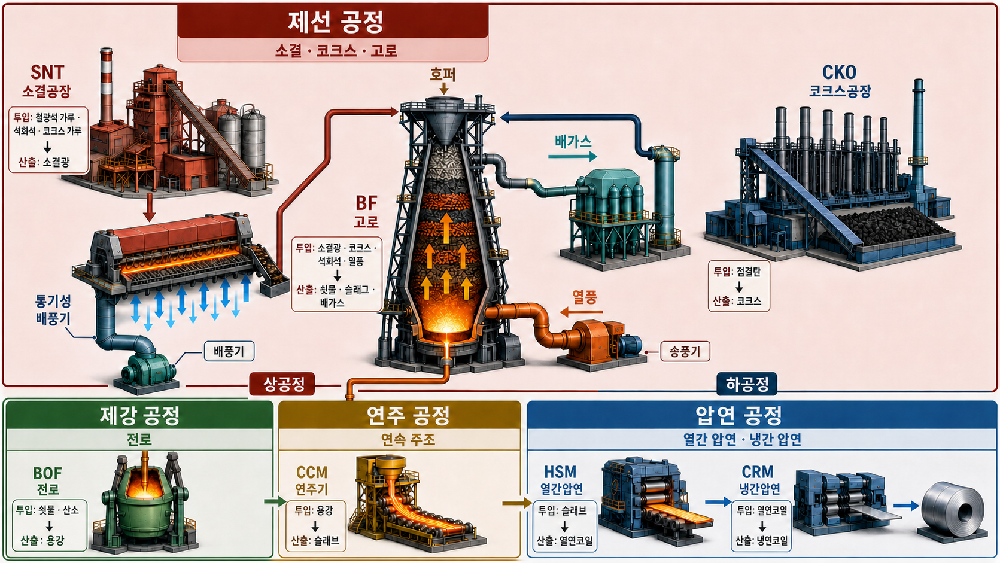

# ⬡ POSCO K-뉴딜 PDM 아카데미


---

## ❖ 소개

```
과정    [K뉴딜] 설비 고장을 예측하는 AI 데이터 분석 · 600시간
경로    코딩 입문 ⇢ Python 기초 ⇢ 시계열 분석 ⇢ 이상 탐지 ⇢ 고장 예측 · RUL
데이터  온도 · 진동 · 압력 등 제조 설비 센서 값
구성    과정별 폴더 · 교안 설명 코드(Python·Ipynb) + 실습(Practice) + 데이터(Data) + 복습본(Remind)
용도    수업 기록 · 복습 · 포트폴리오
```

## ⬡ 과정 정보

| 항목 | 내용 |
| --- | --- |
| 과정명 | [K뉴딜] 설비 고장을 예측하는 AI 데이터 분석 |
| 차수 | 26-001 (취업예정자 › K뉴딜 › 초급) |
| 교육기간 | 2026.07.06 ⇢ 2026.10.27 |
| 학습시간 | 600시간 (주간) |
| 지역 | 포항 |
| 수료기준 | 출석율 80% 이상 |

## ⟡ 학습 로드맵

| 진행 | 단계 | 범위 |
| --- | --- | --- |
| `▰▰▰▰▰▰▰` | **Python 기초 문법** | 출력 · 연산자 · 자료형 · 문자열 · 리스트 · 조건문 · 반복문 · 튜플 · 셋 · 딕셔너리 · 함수 · 모듈 · 파일 입출력 · 예외 처리 |
| `▰▰▰▰▰▰▰` | **데이터 처리 · 기초 통계 · 시각화** | NumPy · 통계 · Pandas · Matplotlib · Seaborn |
| `▰▰▰▰▰▱▱` | **시계열 데이터 분석** | 시간 인덱스 · resample · 이동평균 · 추세 · 변동성 · 시계열 분해 |
| `▰▰▱▱▱▱▱` | **설비 · 공정 도메인 이해** | 철강 공정(제선 · 제강 · 연주 · 압연) 진행 중 |
| `▱▱▱▱▱▱▱` | 이상 탐지 | Anomaly Detection |
| `▱▱▱▱▱▱▱` | 고장 예측 · 잔여수명 | C-MAPSS 기반 RUL 모델링 |
| `▱▱▱▱▱▱▱` | 팀 프로젝트 | 스마트 정비 시스템 · 최종 발표 |

잔여 — 시계열 전처리 마무리 ⇢ 이상 탐지 ⇢ RUL 예측 ⇢ 팀 프로젝트

## ◈ 폴더 구조

```text
posco-pdm-academy/
├── 01_Python_Data_Analysis/   7~8월 Python · 데이터 분석 과정
│   ├── Lecture/
│   ├── Python/
│   ├── Practice/
│   ├── Data/
│   ├── Ipynb/
│   └── Remind/
├── 02_Steel_Process/          8월 31일부터 시작한 철강 공정 과정
│   ├── Lecture/
│   ├── Practice/
│   ├── Data/
│   └── Ipynb/
├── Sandbox/                   과정 공통 실험 공간
└── etc/                       과정 공통 기타 자료
```

과정 번호가 다시 `01-01`부터 시작하므로 과정별 상위 디렉터리에서 교안 번호를 독립적으로 관리한다.

### 01_Python_Data_Analysis 상세 구조

```text
01_Python_Data_Analysis/
├── Python/              교안 설명 코드 · 개념 1개 = 파일 1개
│   ├── 01_print.py
│   ├── 02_operator.py
│   ├── 03_error.py
│   ├── 04_variable.py
│   ├── 05_object.py
│   ├── 06_operator2.py
│   ├── 07_input.py
│   ├── 08_string.py
│   ├── 09_list.py
│   ├── 10_if.py
│   ├── 11_for.py
│   ├── 12_while.py
│   ├── 13_list_update.py
│   ├── 14_tuple.py
│   ├── 15_set.py
│   ├── 16_dictionary.py
│   ├── 17_function1.py
│   ├── 17_function2.py
│   ├── 18_module_1.py
│   ├── 18_module_2.py
│   ├── 19_file_io.py
│   ├── 20_handler.py
│   ├── 21_numpy.py
│   ├── 23_Statistics.py
│   ├── 24_Pandas.py
│   ├── 25_Dataframe.py
│   ├── 26_filtering_sorting.py
│   ├── 27_value_counts.py
│   ├── 28_groupby_agg.py
│   ├── 29_correlation_report.py
│   ├── 30_quantile.py
│   └── 31_dataframe_tools.py
├── Practice/            교안 실습 · review_* 는 종합 실습(복습용)
│   ├── 02_01_example.py
│   ├── 02_02_example.py
│   ├── 02_03_example.py
│   ├── 02_04_example.py
│   ├── 03_01_example.py
│   ├── 03_02_example.py
│   ├── 03_03_example.py
│   ├── 03_04_example.py
│   ├── 03_05_example.py
│   ├── 03_06_example.py
│   ├── 04_01_example.py
│   ├── 04_02_example.py
│   ├── 05_01_example.py
│   ├── 05_02_example.py
│   ├── 05_03_example.py
│   ├── 06_01_example.py
│   ├── 06_02_example.py
│   ├── 07_01_example.py
│   ├── 07_02_example.py
│   ├── 08_01_example.py
│   ├── 08_02_example.py
│   ├── 09_02_example.py
│   ├── 09_03_example.py
│   ├── 10_01_example.py
│   ├── 10_02_example.py
│   ├── 12_01_example.py
│   ├── 12_02_example.py
│   ├── 13_01_example.py
│   ├── 13_02_example.py
│   ├── 14_01_example.py
│   ├── 14_01_example_advanced.py
│   ├── 14_02_example.py
│   ├── 14_03_example.py
│   ├── 15_01_example.py
│   ├── 15_02_example.py
│   ├── 16_01_example.py
│   ├── 16_02_example.py
│   ├── 17_01_example.ipynb
│   ├── 17_02_example.ipynb
│   ├── 18_01_example.ipynb
│   ├── 18_02_example.ipynb
│   ├── 20_01_example.ipynb
│   ├── 20_02_example.ipynb
│   ├── 21_01_example.ipynb
│   ├── 21_02_example.ipynb
│   ├── 21_02_example_6.ipynb
│   ├── 21_03_example.ipynb
│   ├── 21_03_example_5.ipynb
│   ├── 22_01_example.ipynb
│   ├── 22_02_example.ipynb
│   ├── 23_01_example.ipynb
│   ├── 23_02_example.ipynb
│   ├── review_01.py
│   ├── review_02.py
│   ├── review_03.py
│   ├── review_answer_01.py
│   ├── review_answer_02.py
│   └── review_guide.md
├── Data/                실습용 데이터 · 앞 번호 = 교안 차시
│   ├── 08_press.csv
│   ├── 09_ict_inspection.csv
│   ├── 09_ict_inspection_dirty.csv
│   ├── 09_ict_inspection_report.txt
│   ├── 10_mct_tool.csv
│   ├── 12_equipment_sensor.csv
│   ├── 12_metro_compressor.csv
│   ├── 12_metro_compressor_semicolon.csv
│   ├── 12_metro_digital.csv
│   ├── 12_metro_small.csv
│   ├── 13_diecasting_shot.csv
│   ├── 13_diecasting_small.csv
│   ├── 14_equipment_sensor.csv
│   ├── 14_hydraulic.csv
│   ├── 14_hydraulic_qc.csv
│   ├── 15_01_사출성형_공정.csv
│   ├── 15_02_사출성형_공정.csv
│   ├── 15_02_사출성형_공정_clean.csv
│   ├── 15_사출성형_로그.csv
│   ├── 16_diecasting.csv
│   ├── 16_welding.csv
│   ├── 16_welding_cleaned.csv
│   ├── 17_열처리.csv
│   ├── 17_열처리_공정.csv
│   ├── 18_열처리.csv
│   ├── 20_cmapss_fd001_sample.csv
│   ├── 20_engine01_timestamp_sample.csv
│   ├── 21_cmapss_fd001_sample.csv
│   ├── 21_engine1_timestamp_sample.csv
│   ├── 22_열처리.csv
│   ├── 23_cmapss_fd001_sample.csv
│   ├── 23_cmapss_unit1_timestamp.csv
│   ├── sales_data.csv
│   ├── sample.txt
│   ├── student_scores.csv
│   └── students_groupby_practice.csv
├── Ipynb/               노트북으로 진행된 교안 (Python 번호를 이어받음)
│   ├── 2026.07.14 수업.ipynb
│   ├── 32_matplotlib_basic_plots.ipynb
│   ├── 33_seaborn_distribution_category_relationship.ipynb
│   ├── 34_time_series_timeline.ipynb
│   ├── 35_time_index_resample.ipynb
│   └── 월드컵_예측.ipynb
└── Remind/              교과서식 복습 정리본 (.pdf)
│   ├── Git과GitHub_실전.pdf
│   ├── Matplotlib_시각화_기초.pdf
│   ├── Pandas_입문.pdf
│   ├── Seaborn과_시계열의_시작.pdf
│   ├── while_리스트처리_튜플.pdf
│   ├── 결측치_이해와_확인.pdf
│   ├── 결측치_제거와_대체.pdf
│   ├── 그룹별_통계량과_상관관계.pdf
│   ├── 넘파이_배열.pdf
│   ├── 넘파이_연산과_통계.pdf
│   ├── 데이터프레임_탐색과_선택.pdf
│   ├── 딕셔너리.pdf
│   ├── 리스트.pdf
│   ├── 모듈과_경로.pdf
│   ├── 문자열정리_메서드와_fstring.pdf
│   ├── 변화량_다중센서_전처리_파이프라인.pdf
│   ├── 빈도와_그룹_집계.pdf
│   ├── 시간_인덱스와_추세_변동성.pdf
│   ├── 예외처리와_파이프라인.pdf
│   ├── 이상치와_중복_데이터.pdf
│   ├── 입력_형변환_문자열.pdf
│   ├── 자료형과_연산자.pdf
│   ├── 조건_필터링과_정렬.pdf
│   ├── 조건문과_반복문.pdf
│   ├── 커뮤니케이션_교육과정_강의정리.pdf
│   ├── 튜플활용과_셋.pdf
│   ├── 파이썬_데이터분석_문법교과서.pdf
│   ├── 파이썬기초_Git첫걸음.pdf
│   ├── 파일입출력과_예외처리.pdf
│   └── 함수.pdf
```

### 02_Steel_Process 상세 구조

```text
02_Steel_Process/
├── Ipynb/                   공정 개념 정리 (교안이 문서 위주라 .py · .md 혼재)
│   ├── 01_Steel_manufacturing_process.py
│   ├── 02_ManufacturingSite_IronmakingProcess.py
│   └── 03_Steelmaing_Rolling_Process.md
├── Practice/                교안 실습
│   ├── 01-01_example.ipynb
│   └── 01-02_example.ipynb
├── Data/                    실습용 설비 태그 · 조업 데이터
│   ├── 01-01_철강_공정_개관_설비태그.csv
│   └── 01-02_원료_전처리와_제선_제선조업.csv
└── assets/
    └── steel_process_overview.png
```

#### 철강 일관제철 공정 흐름

직접 정리한 전체 공정도. 상공정(제선 → 제강 → 연주)과 하공정(압연)의 설비 약어,
투입물과 산출물을 한 장에 담았다. 앞으로 다룰 센서 데이터가 어느 설비에서 나오는지
짚어보려고 만들었다.



| 구분 | 설비 | 투입 ⇢ 산출 |
| --- | --- | --- |
| 상공정 · 제선 | `SNT` 소결공장 | 철광석 가루 · 석회석 · 코크스 가루 ⇢ 소결광 |
| 상공정 · 제선 | `CKO` 코크스공장 | 점결탄 ⇢ 코크스 |
| 상공정 · 제선 | `BF` 고로 | 소결광 · 코크스 · 석회석 · 열풍 ⇢ 쇳물 · 슬래그 · 배가스 |
| 상공정 · 제강 | `BOF` 전로 | 쇳물 · 산소 ⇢ 용강 |
| 상공정 · 연주 | `CCM` 연주기 | 용강 ⇢ 슬래브 |
| 하공정 · 압연 | `HSM` 열간압연 | 슬래브 ⇢ 열연코일 |
| 하공정 · 압연 | `CRM` 냉간압연 | 열연코일 ⇢ 냉연코일 |

> `Python/22` 는 내용이 `21_numpy.py` 로 통합되어 번호만 비어 있음

로컬 전용 · 원격 제외 (`.gitignore`)

```
Lecture/                          강의 교안 원본 (저작권) · 경로 무관 전부
etc/                              스크린샷
01_Python_Data_Analysis/Python/etc.py  슬라이싱 심화 낙서
COMMIT_CONVENTION.md              커밋 메시지 규칙 (개인 메모)
Sandbox/연습.py                    코드 쓰고 지우는 개인 스크래치
*.png                             실습 그래프 (노트북 출력에 이미 포함)
  └ !02_Steel_Process/assets/*.png   단, README 에 싣는 이미지는 예외
**/*.docx  /*.pdf                 정리본 작업파일 (최종 pdf 만 Remind/ 로)
outputs/  tmp_*/                  작업 산출물 · 임시 폴더
.claude/                          Claude Code 로컬 설정
Sandbox/predictive-maintenance-ai4i/   참고용 외부 레포 (MIT)
```

### ⧉ 디렉토리 역할

| 디렉토리 | 역할 | 파일 |
| --- | --- | --- |
| `*/Python/` | 교수님이 교안 설명하며 친 코드를 따라 적은 것 | `.py` |
| `*/Practice/` | 교안 실습 · 스스로 푼 연습 문제 | `.py` · `.ipynb` |
| `*/Data/` | 실습에서 읽어 쓰는 데이터 | `.csv` · `.txt` |
| `*/Ipynb/` | 주제별로 정리한 수업 노트북 | `.ipynb` |
| `*/Remind/` | 나중에 다시 보려고 만든 교과서식 정리본 | `.pdf` |
| `Sandbox/` | 진도와 별개로 데이터셋을 직접 만져보는 실험실 | `.csv` · `.ipynb` · `.py` |

### ⌗ 네이밍 규칙

| 종류 | 규칙 | 예 |
| --- | --- | --- |
| 교안 설명 코드 | `<번호>_<주제>.py` (내 학습 순서) | `27_value_counts.py` |
| 교안 실습 | `<장>_<절>_example.py` (교안 번호) | `14_01_example.py` |
| 종합 실습 | `review_*` (숫자 접두사와 충돌 방지) | `review_01.py` |
| 실습 데이터 | `<장>_<이름>.csv` | `13_diecasting_shot.csv` |
| AI 챌린지 | `Sandbox/ai_challenge/<교안범위>/` | `05_02-07_03/` |
| 과정 폴더 | `<순번>_<과정명>/` · 교안 번호를 과정별로 독립 관리 | `02_Steel_Process/` |

## ⬢ 학습 현황

| 단원 | 배운 것 | 코드 |
| --- | --- | --- |
| 출력 · 연산자 | `print()` · f-string · `+ - * / // % **` · 우선순위 · 복합 할당 | `01` `02` `06` |
| 오류 | Traceback은 **맨 아래가 진짜 원인** · `SyntaxError` `NameError` `ValueError` | `03_error.py` |
| 변수 · 자료형 | 선언 · 재할당 · 값 복사 · `int` `float` `str` `bool` · `type()` | `04` `05` |
| 입력 · 형변환 | `input()`은 무조건 `str` ↦ `int()` `float()` | `07_input.py` |
| 문자열 | 인덱싱 · 슬라이싱 `[start:end:step]` · `upper` `strip` `replace` `split` `join` | `08_string.py` |
| 리스트 | `append` `insert` `extend` · `remove` `pop` `del` · `sort` · **참조 vs `copy()`** | `09` `13` |
| 조건문 · 반복문 | `if-elif-else` · `for` · `range` · `enumerate` · `while` · `break` `continue` | `10` `11` `12` |
| 튜플 · 셋 | 언패킹 · 중첩 튜플 · 중복 제거 · 집합연산 `& - \|` | `14` `15` |
| 딕셔너리 | `get` `items` `update` `del` · `zip` · 중첩 딕셔너리 | `16_dictionary.py` |
| 함수 | `def` · 매개변수 · 반환값 · 기본값 · 키워드 인자 · 지역변수 | `17_function1~2.py` |
| 모듈 · 경로 | `import` · `math` · `os.path.join` · 상대/절대 경로 | `18_module_1~2.py` |
| 파일 입출력 | `open()` · `r` `w` `a` 모드 · `with` · `csv` · `encoding` | `19_file_io.py` |
| 예외 처리 | `try-except` · `FileNotFoundError` `ValueError` · 파이프라인 방어 | `20_handler.py` |
| NumPy | 배열 생성 · 인덱싱 · 슬라이싱 · 불리언 마스킹 · `np.where` · 다중 조건 | `21_numpy.py` |
| 기초 통계 | 평균 · 표준편차 · 최소/최대 · **정상을 알아야 이상을 안다** | `23_Statistics.py` |
| Pandas 입문 | `read_csv` · `info` · `shape` · `head` `tail` · 구분자 · 인덱스 | `24` `25` |
| 필터링 · 정렬 | 조건 추출 · `isin` · `~` 부정 · `sort_values` · **`.copy()` 경고** | `26_filtering_sorting.py` |
| 빈도 집계 | `value_counts` · `normalize` · `pd.cut` 구간화 · `groupby` | `27_value_counts.py` |
| 그룹 집계 | `groupby` · `agg` · 분산 · 표준편차 · 상관관계 | `28` `29` |
| 사분위수 · 이상치 | `quantile` · `describe` · **IQR = Q3 − Q1** · 박스플롯 · 이상치 경계 | `30_quantile.py` |
| 도구 비교 | Pandas vs Polars vs DuckDB — 같은 집계를 세 방식으로 | `31_dataframe_tools.py` |
| 결측치 | `isna` · `dropna` · `fillna` · `ffill` `bfill` · 보간(linear · time) | `Practice/15_*` `22_02` |
| Matplotlib | `plot` · 색 · 마커 · `figsize` · 산점도 · 막대 · 히스토그램 | `Ipynb/32` |
| Seaborn | `set_theme` · `histplot` · `hue` · 박스플롯 · 관계 시각화 | `Ipynb/33` |
| 시계열 기초 | `to_datetime` · 시간 인덱스 · 슬라이싱 · `resample` · `asfreq` | `Ipynb/34` `35` |
| 시계열 심화 | 변화량 급변 탐지 · 이동평균 창 크기 · 시계열 분해(추세·계절·잔차) | `Practice/21_*` `23_*` |
| 철강 공정 | 제선(SNT·CKO·BF) · 제강(BOF) · 연주(CCM) · 압연(HSM·CRM) | `02_Steel_Process/` |
| Git | `init` `status` `add` `commit` `push` `pull` · `.gitignore` · `.gitattributes` | `git cheatsheet.md` |

실습 예제는 전부 설비 점검 리포트(`온도 / 진동 / 압력`) 컨셉 ⇢ 뒤의 센서 데이터 분석으로 그대로 연결

## ⌑ 기술 스택

**현재** &nbsp;      

**예정** &nbsp;

---

<div align="center">

**[namelesspark](https://github.com/namelesspark)** · 취업까지 완주

</div>
